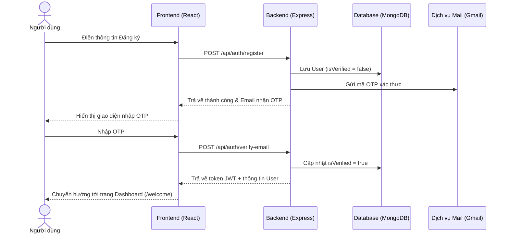

# 🚀 Sprint 1 – Xác Thực Người Dùng

**Goal:** Hoàn thiện toàn bộ luồng Authentication (Đăng ký → OTP → Đăng nhập → Reset mật khẩu) và Quản lý Hồ sơ cá nhân cơ bản.

---

## 1. Danh Sách User Stories

| ID | User Story | Story Points | Kết Quả | Chi Tiết Kỹ Thuật |
|---|---|---|---|---|
| **EP1-1** | Đăng ký tài khoản | 3 | ✅ Hoàn thành | API `POST /api/auth/register`. Hỗ trợ validate dữ liệu đầu vào, mã hóa mật khẩu bằng `bcryptjs` và sinh mã OTP kích hoạt tài khoản. |
| **EP1-2** | Xác thực email OTP | 5 | ✅ Hoàn thành | API `POST /api/auth/verify-email`. Gửi OTP qua Nodemailer. Khi kích hoạt thành công, chuyển thuộc tính `isVerified` trong Model `User` thành `true`. |
| **EP1-3** | Đăng nhập → JWT | 3 | ✅ Hoàn thành | API `POST /api/auth/login`. So khớp mật khẩu đã hash, kiểm tra tài khoản đã xác thực chưa và phát hành JWT token. |
| **EP1-4** | Quên / Reset mật khẩu | 5 | ✅ Hoàn thành | API `POST /api/auth/forgot-password` (gửi OTP reset) và `POST /api/auth/reset-password` (đổi mật khẩu mới kèm OTP). |
| **EP1-5** | Xem & sửa hồ sơ cá nhân | 3 | ✅ Hoàn thành | API `GET /api/users/profile` và `PUT /api/users/profile` để cập nhật họ tên và ảnh đại diện (avatar). |
| **EP1-6** | Đổi mật khẩu | 2 | ✅ Hoàn thành | API `PUT /api/users/change-password` cho phép thay đổi mật khẩu từ trong màn hình cài đặt (Settings). |
| **EP1-7** | ProtectedRoute frontend | 2 | ✅ Hoàn thành | Component `ProtectedRoute` tại frontend sử dụng React Context (`AuthContext`) để ngăn cản người dùng chưa đăng nhập truy cập các trang Dashboard, Profile, v.v. |

---

## 2. Minh Họa Luồng Hoạt Động (Flow)

---

## 3. Retrospective Sprint 1

**Điểm tốt (What went well):**
- Cơ chế gửi mail OTP chạy ổn định, giao diện nhập OTP tại frontend tự động chuyển focus mượt mà.
- Thiết lập phân tách các lớp Route - Controller - Model - Service rõ ràng cho các tính năng xác thực.

**Cần cải thiện (To improve):**
- Token hết hạn nhanh cần cải thiện trải nghiệm bằng cách thêm cơ chế tự động gia hạn token (Refresh Token) ở các sprint sau.
- Cần có cơ chế chống spam gửi lại OTP liên tục (Rate limiting).
