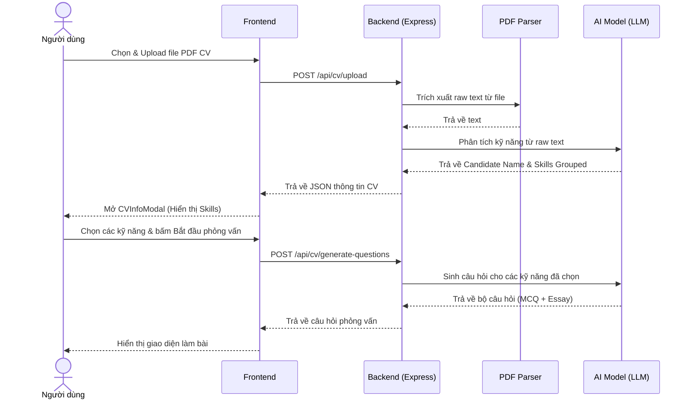

# 🚀 Sprint 3 – CV Interview

**Goal:** Triển khai tính năng phỏng vấn theo CV (Tải lên CV → Trích xuất văn bản → Phân tích kỹ năng bằng AI → Người dùng lựa chọn kỹ năng phỏng vấn → Sinh câu hỏi cá nhân hóa → Nộp bài & Đánh giá).

---

## 1. Danh Sách User Stories

| ID | User Story | Story Points | Kết Quả | Chi Tiết Kỹ Thuật |
|---|---|---|---|---|
| **EP3-1** | Tải lên CV (PDF) | 5 | ✅ Hoàn thành | Tích hợp Multer tại backend (`POST /api/cv/upload`) để nhận tệp CV dạng PDF. Lưu trữ tạm thời và tự động xóa sau khi xử lý xong. |
| **EP3-2** | Trích xuất nội dung CV | 3 | ✅ Hoàn thành | Sử dụng thư viện `pdf-parse` để đọc toàn bộ dữ liệu chữ (raw text) từ file PDF được tải lên. |
| **EP3-3** | Phân tích kỹ năng bằng AI | 8 | ✅ Hoàn thành | API `POST /api/cv/analyze-text`. Gửi nội dung CV đến AI để phân loại các kỹ năng tìm thấy thành 4 nhóm: Frontend, Backend, Theory, DevOps, đồng thời trích xuất họ tên ứng viên. |
| **EP3-4** | Chọn kỹ năng & Sinh câu hỏi | 8 | ✅ Hoàn thành | Mở modal `CVInfoModal` hiển thị thông tin trích xuất. Cho phép người dùng chọn tối đa 4 kỹ năng cụ thể. Gọi `POST /api/cv/generate-questions` để sinh câu hỏi tương ứng. |
| **EP3-5** | Phòng phỏng vấn theo CV | 8 | ✅ Hoàn thành | Giao diện `InterviewCVPage` hiển thị các câu hỏi trắc nghiệm và tự luận tùy biến theo kỹ năng đã chọn của ứng viên. |
| **EP3-6** | Nộp bài và lưu kết quả | 5 | ✅ Hoàn thành | API `POST /api/cv/submit-answers`. AI chấm điểm từng câu, đưa ra nhận xét chung về điểm mạnh, điểm yếu và gợi ý học tập. Lưu vào collection `cvinterviewsessions`. |

---

## 2. Quy Trình Trích Xuất & Sinh Câu Hỏi (CV Flow)

---

## 3. Retrospective Sprint 3

**Điểm tốt (What went well):**
- Thư viện `pdf-parse` hoạt động nhẹ nhàng và trích xuất text tiếng Việt chính xác.
- Việc phân loại kỹ năng thành 4 nhóm giúp người dùng dễ dàng lựa chọn đúng chủ đề thế mạnh hoặc cần luyện tập của mình.

**Cần cải thiện (To improve):**
- Với các CV có thiết kế dạng cột phức tạp (two-column CV), thứ tự trích xuất text của `pdf-parse` có thể bị đảo lộn, ảnh hưởng đến kết quả phân tích họ tên. Đã tối ưu bằng các prompt AI thông minh hơn để nhận dạng lại tên chính xác.
