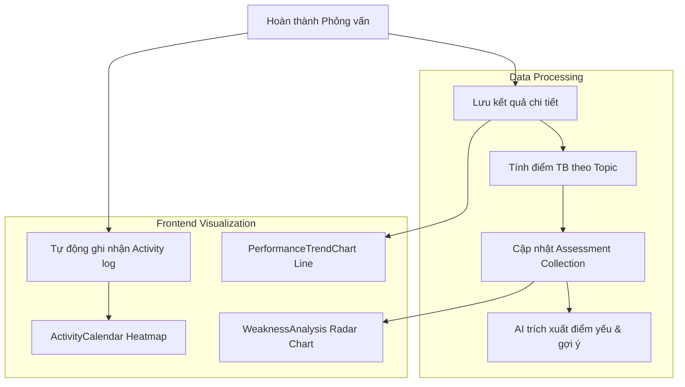

# 🚀 Sprint 4 – History & Analytics

**Goal:** Xây dựng hệ thống lưu trữ lịch sử, theo dõi tiến độ luyện tập và hiển thị các biểu đồ phân tích hiệu suất cá nhân hóa cho người dùng.

---

## 1. Danh Sách User Stories

| ID | User Story | Story Points | Kết Quả | Chi Tiết Kỹ Thuật |
|---|---|---|---|---|
| **EP4-1** | Lịch sử phỏng vấn tiêu chuẩn | 3 | ✅ Hoàn thành | Trang `/history` hiển thị danh sách các bài thi tiêu chuẩn đã thực hiện. Route chi tiết `/history/:id` xem lại từng câu trả lời và feedback của bài thi đó. |
| **EP4-2** | Lịch sử phỏng vấn theo CV | 3 | ✅ Hoàn thành | Trang `/cv-history` và trang chi tiết `/cv-history/:id` hiển thị thông tin bài phỏng vấn CV tương ứng. |
| **EP4-3** | Biểu đồ xu hướng hiệu suất | 5 | ✅ Hoàn thành | Component `PerformanceTrendChart` sử dụng thư viện `recharts` vẽ biểu đồ đường (Line chart) thể hiện sự thay đổi điểm số trung bình qua các lần thi. |
| **EP4-4** | Lịch hoạt động Heatmap | 5 | ✅ Hoàn thành | Component `ActivityCalendar` lấy dữ liệu hoạt động hàng ngày từ API `/api/activity` vẽ heatmap biểu thị tần suất tập luyện trong năm (tương tự GitHub). |
| **EP4-5** | Radar chart phân tích điểm yếu | 8 | ✅ Hoàn thành | Component `WeaknessAnalysis` gọi API `/api/weakness/me` vẽ biểu đồ Radar thể hiện điểm số trung bình theo từng chủ đề và hiển thị các gợi ý tự động từ AI. |
| **EP4-6** | Tự động ghi nhận Activity | 2 | ✅ Hoàn thành | Mỗi lần hoàn thành phỏng vấn (Standard / CV / Adaptive), backend tự động lưu hoặc tăng count của ngày hiện tại trong collection `activities`. |

---

## 2. Mô Hình Tổng Hợp Dữ Liệu Phân Tích (Analytics Flow)

---

## 3. Retrospective Sprint 4

**Điểm tốt (What went well):**
- Biểu đồ Recharts hiển thị rất mượt mà trên cả giao diện sáng lẫn tối (Light/Dark mode) nhờ sử dụng CSS variables đồng bộ.
- Tự động hóa việc ghi nhận activity log tại backend giúp dữ liệu heatmap luôn chính xác ngay khi user submit bài thi.

**Cần cải thiện (To improve):**
- Phân tích điểm yếu (WeaknessAnalysis) ban đầu mất nhiều thời gian chạy truy vấn vì phải quét qua toàn bộ database. Đã khắc phục bằng cách tạo index `{ userId: 1, date: -1 }` trên các collection và lưu trữ điểm số trung bình đã tổng hợp sẵn vào collection `assessments`.
