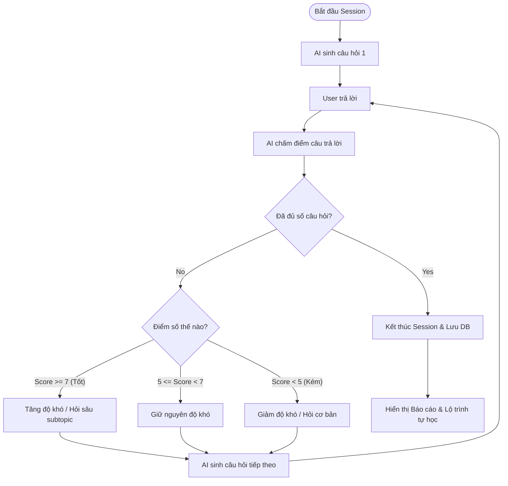

# 🚀 Sprint 5 – Adaptive Interview

**Goal:** Triển khai cơ chế phỏng vấn thích ứng thông minh (Chọn chủ đề → Phỏng vấn dạng hội thoại trực tiếp → Trả lời câu hỏi → AI chấm điểm, phân tích độ hiểu biết để tăng/giảm độ khó và đưa ra câu hỏi tiếp theo phù hợp → Báo cáo chi tiết).

---

## 1. Danh Sách User Stories

| ID | User Story | Story Points | Kết Quả | Chi Tiết Kỹ Thuật |
|---|---|---|---|---|
| **EP5-1** | Khởi tạo Adaptive Session | 3 | ✅ Hoàn thành | API `POST /api/adaptive/start`. Khởi tạo một tài liệu mới trong collection `adaptivesessions`, chọn mức độ khó ban đầu và sinh câu hỏi đầu tiên. |
| **EP5-2** | Giao diện phòng phỏng vấn thích ứng | 8 | ✅ Hoàn thành | Giao diện `AdaptiveInterviewPage` dạng hội thoại (chat-like) hoặc câu hỏi tuần tự. Hiển thị lịch sử hội thoại sinh động giữa AI và người dùng. |
| **EP5-3** | Nộp câu trả lời thời gian thực | 5 | ✅ Hoàn thành | API `POST /api/adaptive/answer`. Người dùng điền câu trả lời tự luận và bấm Gửi, hệ thống lập tức chuyển đến AI để chấm điểm của câu đó (thang điểm 0-10). |
| **EP5-4** | Tự động điều chỉnh độ khó | 8 | ✅ Hoàn thành | AI phân tích câu trả lời: Nếu trả lời tốt (Score >= 7) và hiểu sâu, AI tự động tăng độ khó hoặc hỏi sâu hơn về khía cạnh đó. Nếu trả lời kém (Score < 5), AI chuyển sang câu hỏi dễ hơn hoặc giải thích cơ bản hơn. |
| **EP5-5** | Kết thúc & Báo cáo tổng kết | 5 | ✅ Hoàn thành | Khi đạt đến giới hạn câu hỏi (Max follow-ups) hoặc khi AI thấy đủ dữ kiện đánh giá, session chuyển sang trạng thái `completed`. API trả về báo cáo tổng kết gồm điểm trung bình, điểm mạnh, điểm yếu và sơ đồ phát triển kỹ năng (Roadmap). |

---

## 2. Lưu Đồ Điều Chỉnh Độ Khó Thích Ứng (Adaptive Flow)

---

## 3. Retrospective Sprint 5

**Điểm tốt (What went well):**
- Cơ chế thích ứng tự động hóa 100% bằng AI hoạt động tự nhiên, mang lại cảm giác phỏng vấn chân thực như với người thật.
- Báo cáo kết thúc cung cấp lộ trình Roadmap học tập cá nhân hóa rất hữu ích cho người dùng ôn luyện.

**Cần cải thiện (To improve):**
- Do việc gọi AI chấm điểm và sinh câu hỏi tiếp theo diễn ra tuần tự, thời gian tải (loading) giữa các câu hỏi đôi khi lên tới 5-7 giây. Đã tối ưu bằng cách tối giản prompt của hệ thống chấm điểm và sử dụng các model AI có tốc độ phản hồi nhanh hơn.
