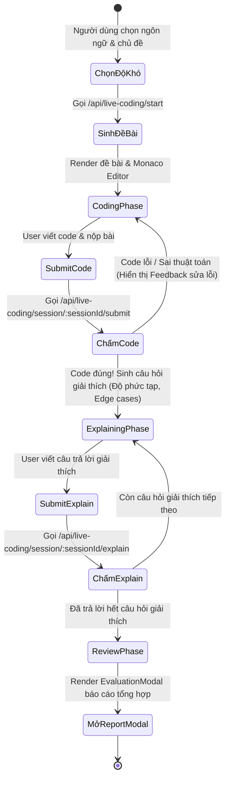

# 🚀 Sprint 6 – Live Coding

**Goal:** Xây dựng tính năng lập trình trực tiếp với trình soạn thảo code tích hợp và chấm điểm tự động bằng AI (Chọn ngôn ngữ/chủ đề → Monaco Editor viết code → AI đánh giá cú pháp & thuật toán → Câu hỏi phụ giải thích độ phức tạp thuật toán → Đóng gói báo cáo chi tiết).

---

## 1. Danh Sách User Stories

| ID | User Story | Story Points | Kết Quả | Chi Tiết Kỹ Thuật |
|---|---|---|---|---|
| **EP6-1** | Chọn ngôn ngữ & chủ đề lập trình | 3 | ✅ Hoàn thành | Trang `LiveCodingPage` cho phép chọn ngôn ngữ (JavaScript, Python, Java), domain (OOP, Async, ...) và topic cụ thể kèm độ khó. |
| **EP6-2** | Tích hợp Monaco Editor | 8 | ✅ Hoàn thành | Sử dụng thư viện `@monaco-editor/react` để cung cấp trình soạn thảo code có màu cú pháp, số dòng và tự động thụt lề trực tiếp trên trình duyệt. |
| **EP6-3** | Sinh đề bài coding tự động | 5 | ✅ Hoàn thành | API `POST /api/live-coding/start` gọi AI thiết lập session và sinh ra bài toán lập trình kèm theo ví dụ đầu vào/đầu ra (Input/Output). |
| **EP6-4** | Nộp code và AI đánh giá thuật toán | 8 | ✅ Hoàn thành | API `POST /api/live-coding/session/:sessionId/submit`. AI phân tích giải pháp của người dùng, kiểm tra xem thuật toán có giải quyết đúng bài toán không. |
| **EP6-5** | Chu kỳ câu hỏi giải thích code | 5 | ✅ Hoàn thành | Sau khi code đúng, API yêu cầu người dùng trả lời 1-2 câu hỏi phụ để giải thích giải pháp của mình (ví dụ: Độ phức tạp thời gian/không gian O(N), xử lý edge cases). |
| **EP6-6** | Báo cáo chi tiết Live Coding | 5 | ✅ Hoàn thành | Sử dụng `EvaluationModal` hiển thị báo cáo chi tiết: Nhận xét thuật toán, ưu nhược điểm của code, điểm số, và phần Hỏi & Đáp giải thích thuật toán. |
| **EP6-7** | Lưu trữ lịch sử coding | 3 | ✅ Hoàn thành | Lưu thông tin chi tiết phiên coding bao gồm lịch sử thay đổi code và đánh giá vào collection `livecodingsessions` và hiển thị tại `/coding-history`. |

---

## 2. Luồng Phản Hồi Khi Làm Bài Live Coding (Coding & Explanation Loop)

---

## 3. Retrospective Sprint 6

**Điểm tốt (What went well):**
- Monaco Editor hoạt động rất mượt mà trên UI, hỗ trợ tốt các phím tắt soạn thảo cơ bản giúp trải nghiệm lập trình như đang dùng VS Code.
- Luồng rèn luyện tư duy thuật toán thông qua câu hỏi giải thích (Explanation Q&A) được mentor đánh giá cao vì rèn luyện được khả năng trình bày phỏng vấn của ứng viên.

**Cần cải thiện (To improve):**
- Tránh việc người dùng có thể gian lận hoặc submit code rỗng, frontend đã bổ sung validation kiểm tra độ dài code tối thiểu trước khi gửi lên backend.
- Phục hồi lại code cũ khi người dùng vô tình reload trang: Đã bổ sung cơ chế tự động lưu code tạm thời vào `localStorage` của trình duyệt.
