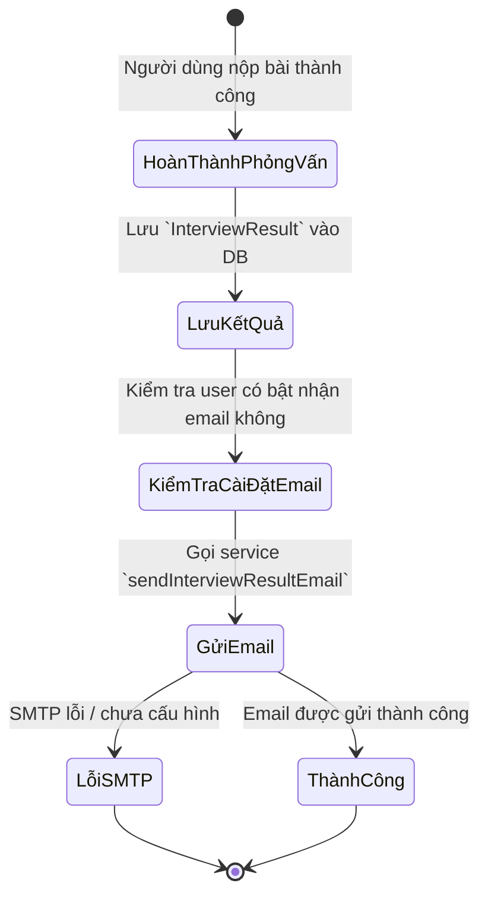

# 📧 Sprint 8 – Interview Result Email Delivery

**Goal:** Sau khi người dùng hoàn thành một bài phỏng vấn thành công, hệ thống sẽ gửi email chứa điểm tổng, kết quả chi tiết ngắn gọn và đường dẫn xem lịch sử cho người dùng.

---

## 1. Danh Sách User Stories

| ID | User Story | Story Points | Kết Quả | Chi Tiết Kỹ Thuật |
|---|---|---:|---|---|
| **EP8-1** | Gửi email kết quả phỏng vấn sau khi submit thành công | 5 | ⏳ Chưa triển khai | Sau khi `POST /api/interviews/submit` hoặc tương đương lưu kết quả thành công, backend gọi service gửi email cho người dùng. |
| **EP8-2** | Tạo template email thân thiện và dễ đọc | 3 | ⏳ Chưa triển khai | Email hiển thị tên người dùng, chủ đề phỏng vấn, mức độ khó, tổng điểm, thời gian hoàn thành và link xem lịch sử. |
| **EP8-3** | Lấy thông tin email từ tài khoản người dùng | 2 | ⏳ Chưa triển khai | Dùng trường `email` từ model `User` hoặc từ `req.user` để xác định người nhận. |
| **EP8-4** | Quản lý cờ bật/tắt thông báo qua email | 3 | ⏳ Chưa triển khai | Tích hợp với trang `/settings` để người dùng quyết định có nhận email kết quả hay không; ưu tiên lưu cấu hình ở backend để đồng bộ giữa các thiết bị. |
| **EP8-5** | Xử lý lỗi SMTP và fallback an toàn | 3 | ⏳ Chưa triển khai | Nếu SMTP chưa cấu hình hoặc gửi email thất bại, hệ thống ghi log, không làm gián đoạn luồng làm bài và trả về warning hợp lệ. |

---

## 2. Luồng Hoạt Động Đề Xuất

---

## 3. Phạm Vi Kỹ Thuật Gợi Ý

- Backend:
  - Tận dụng `nodemailer` hiện có trong `backend/controllers/authController.js` để tạo service gửi email riêng cho kết quả phỏng vấn.
  - Tạo module mới như `backend/services/notifications/emailService.js` hoặc thư mục tương đương.
  - Sau khi lưu `InterviewResult`, gọi hàm gửi email trong controller xử lý submit bài phỏng vấn.

- Frontend:
  - Mở rộng trang `/settings` để người dùng bật/tắt nhận email kết quả sau mỗi lần làm bài.
  - Có thể hiển thị thông báo nhỏ khi gửi email thành công/thất bại.

- Cấu hình môi trường:
  - `EMAIL_USER`, `EMAIL_PASS`, `EMAIL_FROM` (nếu cần).
  - Có thể thêm biến `EMAIL_ENABLED=false` để tắt gửi mail ở môi trường dev/test.

---

## 4. Tiêu Chí Chấp Nhận

- Người dùng nhận được email sau khi hoàn thành một bài phỏng vấn thành công.
- Email chứa ít nhất: tên đề tài, tổng điểm, thời gian hoàn thành và link xem lịch sử.
- Nếu cài đặt email bị tắt hoặc SMTP lỗi, hệ thống vẫn lưu kết quả phỏng vấn bình thường.
- Giao diện cài đặt cho phép bật/tắt việc nhận email.

---

## 5. Retrospective Sprint 8 (Kế Hoạch)

**Điểm tốt mong đợi:**
- Tận dụng được nền tảng email đã có sẵn từ auth flow, giảm thời gian phát triển.
- Tăng giá trị trải nghiệm người dùng bằng email nhận kết quả ngay sau khi làm bài.

**Cần lưu ý:**
- Cần tránh làm chậm luồng submit interview vì gửi email không nên block request chính quá lâu.
- Nên xử lý gửi mail bất đồng bộ hoặc background job để tăng độ tin cậy.
