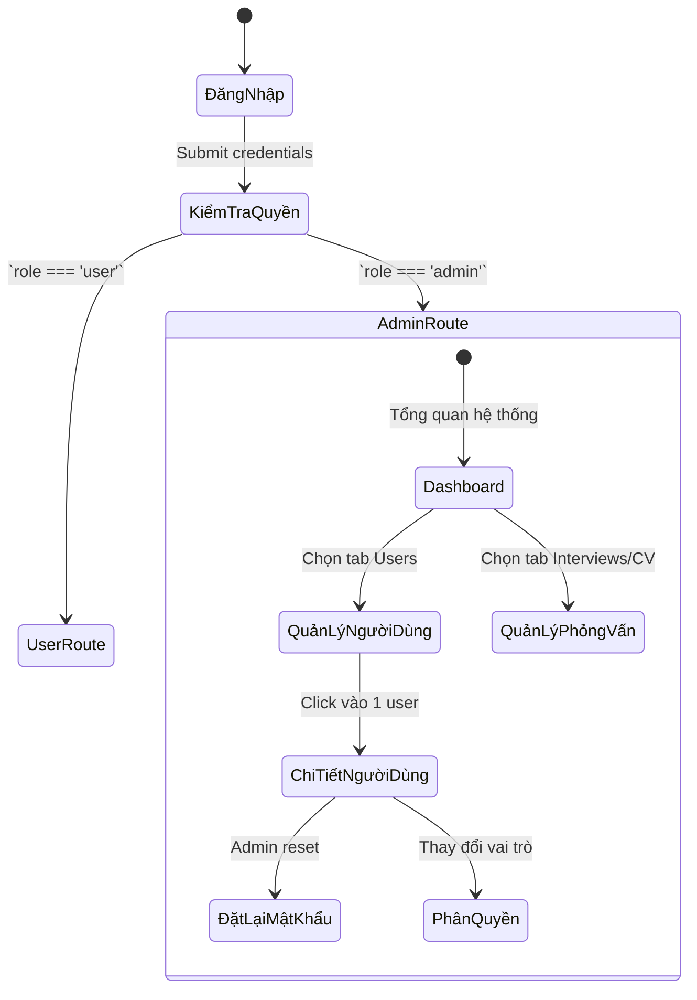

# 🛡️ Sprint 9 – Admin Dashboard & Management Module

**Goal:** Xây dựng module quản trị (Admin Dashboard) cung cấp cho quản trị viên các công cụ mạnh mẽ để giám sát hệ thống, quản lý người dùng, xem xét toàn bộ các phiên phỏng vấn và CV, cũng như chuẩn bị hạ tầng quản lý cho các tính năng nâng cao (Adaptive Interview, Live Coding).

---

## 1. Danh Sách User Stories

| ID | User Story | Story Points | Kết Quả | Chi Tiết Kỹ Thuật |
|---|---|---:|---|---|
| **EP9-1** | Xây dựng Admin Layout và hệ thống định tuyến (Routing) bảo mật | 5 | ✅ Đã hoàn thành | Thiết lập `AdminRoute`, `AdminLayout` và tích hợp vào `App.js`. Chỉ các user có `role === 'admin'` mới truy cập được. |
| **EP9-2** | Dashboard tổng quan thống kê hệ thống | 5 | ✅ Đã hoàn thành | Xây dựng trang `Dashboard.jsx`. Gọi API `/api/users/admin/users/stats` để hiển thị tổng user, số verified user và admin. Liệt kê người dùng mới đăng ký. |
| **EP9-3** | Quản lý người dùng (Users Management) | 8 | ✅ Đã hoàn thành | Tạo `UsersList.jsx` hiển thị danh sách dạng bảng, phân trang. `UserDetail.jsx` cho phép xem chi tiết, đổi trạng thái và reset mật khẩu từ admin. |
| **EP9-4** | Quản lý lịch sử phỏng vấn (Standard & CV) | 8 | ✅ Đã hoàn thành | Tạo `Interviews.jsx` và `CVHistory.jsx`. Admin xem được toàn bộ bài test của hệ thống, xem điểm, các đánh giá, kết quả phân tích CV qua các API Admin. |
| **EP9-5** | Quản lý Live Coding & Adaptive Sessions | 8 | ⏳ Đang triển khai | Tạo các trang `CodingSessions.jsx` và `AdaptiveSessions.jsx`. Hiện tại đã có giao diện khung chờ (coming soon). Cần thêm API ở Backend cho các module này tương tự thư mục CV/Interview. |
| **EP9-6** | Xem System Logs và Cài đặt (Settings) | 5 | ⏳ Đang triển khai | Tạo các trang `SystemLogs.jsx`, `Settings.jsx`. Chờ cung cấp API ghi log hệ thống từ backend để hiển thị ở frontend. |

---

## 2. Luồng Hoạt Động Đề Xuất

---

## 3. Phạm Vi Kỹ Thuật Gợi Ý

- **Backend:**
  - Middleware `admin.js` để xác thực `req.user.role === 'admin'`.
  - Bổ sung các controller và route riêng lẻ (`/api/users/admin/*`, `/api/interview/admin/*`, `/api/cv/admin/*`).
  - Sắp tới cần phát triển thêm Controller và route cho `liveCoding` và `adaptiveInterview` để Admin truy xuất dữ liệu.

- **Frontend:**
  - Thêm wrapper `<AdminWrapper>` trong `App.js` với `forcedTheme="light"` để giao diện Admin luôn ổn định, tách biệt hoàn toàn với theme tùy chỉnh của người dùng thường.
  - Sử dụng TailwindCSS kết hợp với thư viện icon (Lucide) để tạo bảng (Table), biểu đồ (Chart), và các thẻ thống kê (Stat Cards) chuyên nghiệp.
  - Xử lý thông báo (Toast) khi thực hiện các tác vụ nhạy cảm như xóa user, reset mật khẩu.

- **Bảo mật:**
  - Không cho phép người dùng bình thường tiếp cận route quản trị. Middleware phía BE và FE đều phải kiểm tra song song để chặn các Request rác.
  - Các log hành động của admin (VD: Admin A xóa User B) nên được ghi lại phục vụ cho `SystemLogs`.

---

## 4. Tiêu Chí Chấp Nhận

- Tất cả các URL dạng `/admin/*` đều bị chặn nếu truy cập từ tài khoản người dùng bình thường, chuyển hướng về trang chủ một cách an toàn.
- Dashboard hiển thị đúng số liệu thật từ Database (tổng user, tổng lượt thi...).
- Bảng danh sách người dùng, phỏng vấn có thanh tìm kiếm, phân trang mượt mà.
- Admin có thể thực hiện thao tác quản trị trên bất kỳ user nào (xem, reset password, ban/unban - nếu có).

---

## 5. Retrospective Sprint 9 (Kế Hoạch)

**Điểm tốt mong đợi:**
- Tách biệt rõ ràng luồng quản trị viên và người dùng (khác nhau về theme, layout, bảo vệ JWT chặt chẽ).
- Giao diện Dashboard được thiết kế trực quan, dễ dàng theo dõi chỉ số.

**Cần lưu ý:**
- Bảng dữ liệu có thể tốn tài nguyên (Performance) nếu lượng Data lớn, cần áp dụng phân trang (Pagination) ở cả Backend (limit/skip) lẫn Frontend.
- Tính năng Live Coding và Adaptive Interviews cần có API quản trị riêng nhưng khá phức tạp do dữ liệu của các phiên này lớn, nên trả về dữ liệu tinh gọn (summary) ở màn danh sách.
