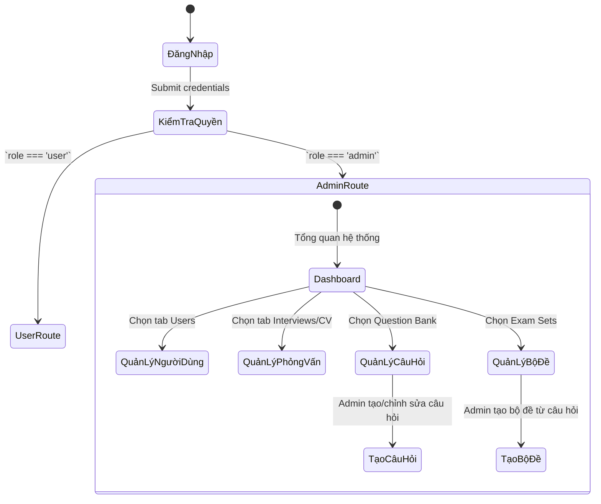

# 🛡️ Sprint 9 – Admin Dashboard & Management Module

**Goal:** Xây dựng module quản trị (Admin Dashboard) cung cấp cho quản trị viên các công cụ mạnh mẽ để giám sát hệ thống, quản lý người dùng, quản lý ngân hàng câu hỏi và bộ đề thi, đồng thời theo dõi toàn bộ các phiên phỏng vấn và hoạt động AI.

---

## 1. Danh Sách User Stories

| ID        | User Story                                                     | Story Points | Kết Quả          | Chi Tiết Kỹ Thuật                                                                                                                        |
| --------- | -------------------------------------------------------------- | -----------: | ---------------- | ---------------------------------------------------------------------------------------------------------------------------------------- |
| **EP9-1** | Xây dựng Admin Layout và hệ thống định tuyến (Routing) bảo mật |            5 | ✅ Đã hoàn thành | Thiết lập `AdminRoute`, `AdminLayout` và tích hợp vào `App.js`. Chỉ các user có `role === 'admin'` mới truy cập được.                    |
| **EP9-2** | Dashboard tổng quan thống kê hệ thống                          |            5 | ✅ Đã hoàn thành | Xây dựng trang `Dashboard.jsx` gọi các API admin để hiển thị tổng user, verified user, admin, token usage và hoạt động gần đây.          |
| **EP9-3** | Quản lý người dùng (Users Management)                          |            8 | ✅ Đã hoàn thành | Tạo `UsersList.jsx` và `UserDetail.jsx` cho phép xem danh sách, chỉnh quyền, reset mật khẩu và xem thông tin chi tiết.                   |
| **EP9-4** | Quản lý lịch sử phỏng vấn (Standard & CV)                      |            8 | ✅ Đã hoàn thành | Tạo `Interviews.jsx` và `CVHistory.jsx` để xem toàn bộ lịch sử phỏng vấn, điểm số và đánh giá từ AI.                                     |
| **EP9-5** | Quản lý Live Coding & Adaptive Sessions                        |            8 | ✅ Đã hoàn thành | Tạo `CodingSessions.jsx` và `AdaptiveSessions.jsx` để xem và xóa các phiên live coding/adaptive.                                         |
| **EP9-6** | Quản lý Question Bank & Exam Sets                              |            8 | ✅ Đã hoàn thành | Thêm `QuestionManagement.jsx`, `ExamSetManagement.jsx` và các modal tạo/chỉnh sửa/import Excel để admin tạo và quản lý bộ câu hỏi/bộ đề. |
| **EP9-7** | Xem System Logs và Cài đặt (Settings)                          |            5 | ✅ Đã hoàn thành | Tạo `SystemLogs.jsx` và `Settings.jsx` để theo dõi hoạt động hệ thống và cấu hình chung.                                                 |

---

## 2. Luồng Hoạt Động Chính

---

## 3. Phạm Vi Kỹ Thuật Đã Triển Khai

- **Backend:**
  - Middleware `admin.js` để xác thực `req.user.role === 'admin'`.
  - Bổ sung route và controller cho admin quản lý users, interviews, CV, adaptive, live coding, question bank và exam sets.
  - Hỗ trợ upload/import Excel cho Question Bank và tạo Exam Sets từ các câu hỏi active.

- **Frontend:**
  - `AdminLayout` và `AdminRoute` bảo vệ toàn bộ khu vực admin.
  - `QuestionManagement` cho phép tạo/chỉnh sửa câu hỏi, lọc/search, kích hoạt/vô hiệu, import/export Excel.
  - `ExamSetManagement` cho phép tạo/chỉnh sửa bộ đề, thêm/xóa câu hỏi, bật/tắt trạng thái bộ đề.
  - Các modal `CreateQuestionModal`, `CreateExamSetModal`, `ExamSetDetailModal`, `ImportExcelModal` hỗ trợ thao tác trực quan.

- **Bảo mật:**
  - Chặn toàn bộ route `/admin/*` khi tài khoản không phải admin.
  - Các thao tác nhạy cảm như xóa user, xóa câu hỏi hoặc bộ đề đều được xác nhận trước khi thực hiện.

---

## 4. Tiêu Chí Hoàn Thành

- Tất cả các URL dạng `/admin/*` đều bị chặn nếu truy cập từ tài khoản người dùng bình thường.
- Dashboard hiển thị đúng số liệu thật từ database.
- Admin có thể quản lý Question Bank và Exam Sets một cách đầy đủ: tạo, chỉnh sửa, kích hoạt/vô hiệu, import/export, thêm/xóa câu hỏi vào bộ đề.
- Giao diện có thanh tìm kiếm, lọc, thống kê và thao tác trực quan cho các danh sách dữ liệu lớn.

---

## 5. Retrospective Sprint 9

**Điểm tốt:**

- Luồng quản trị viên đã tách biệt rõ ràng khỏi luồng người dùng và hoạt động ổn định.
- Admin có thể tự tạo ngân hàng câu hỏi và tổ chức thành bộ đề thi phục vụ người dùng luyện tập.

**Lưu ý tiếp theo:**

- Nếu mở rộng quy mô dữ liệu, nên tiếp tục tối ưu pagination và tìm kiếm ở cả backend lẫn frontend.
- Có thể bổ sung thêm thống kê chi tiết cho Exam Sets như điểm trung bình, tỷ lệ hoàn thành và leaderboard.
